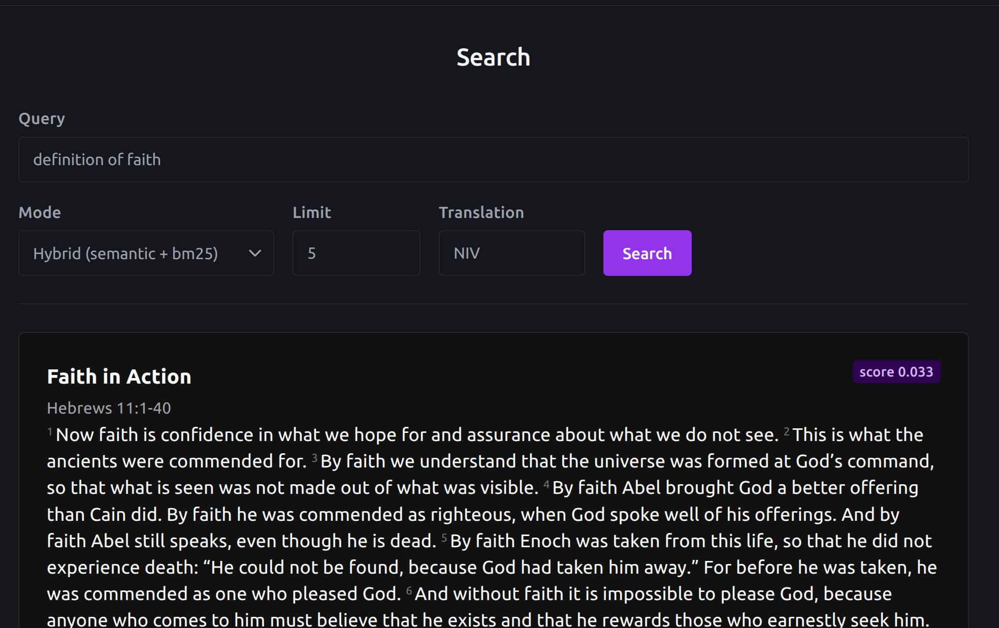
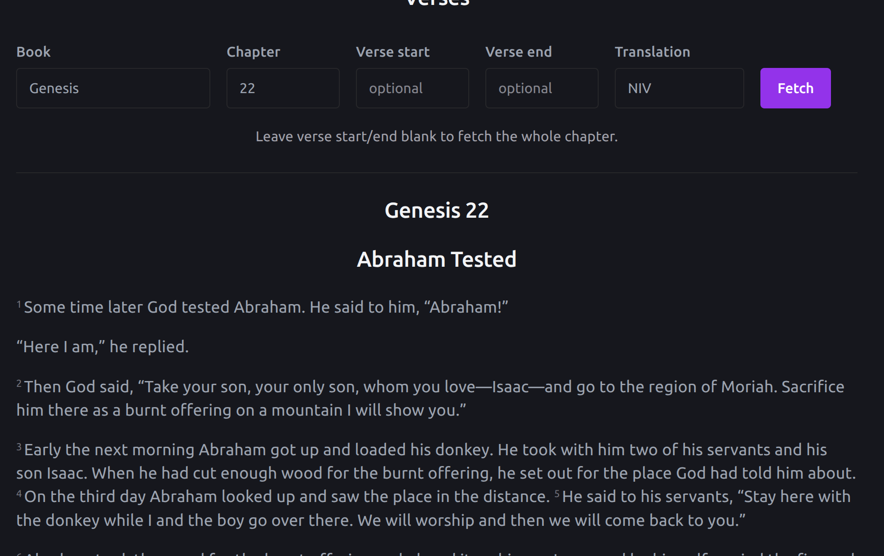
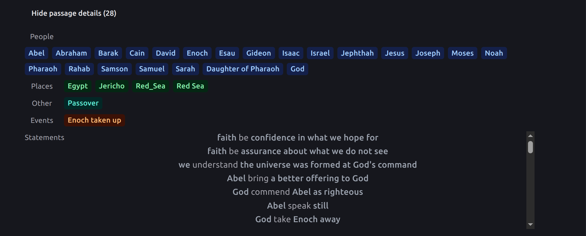
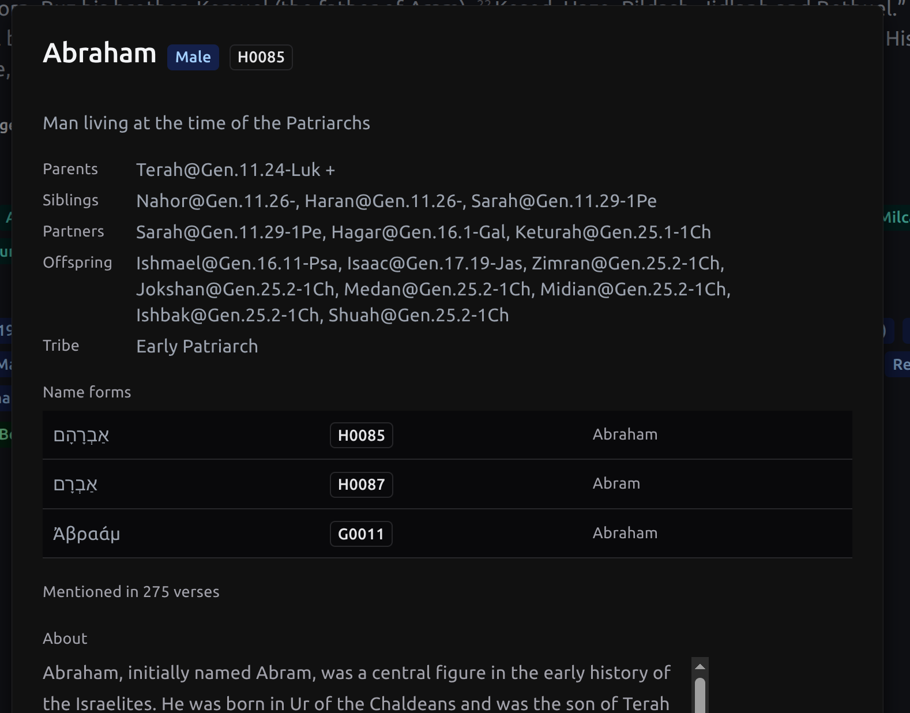
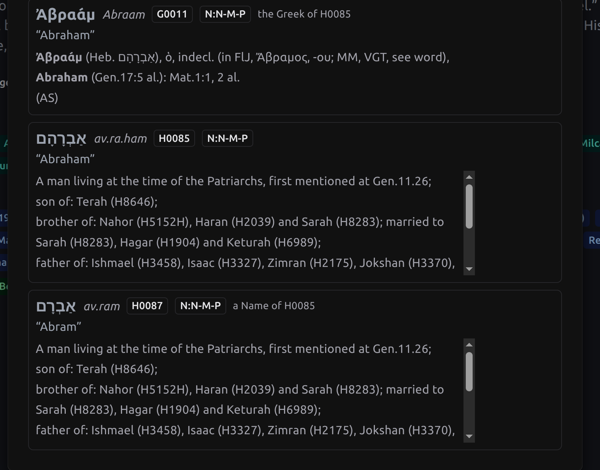

# Theo

Theo is a Bible study tool that searches by meaning, not just keywords, and
connects every verse to the people, places, events, and original Hebrew or
Greek words behind it.

Under the hood: hybrid vector + full-text search over 29 English translations
on Postgres via [ParadeDB](https://paradedb.com) (pgvector + pg_search/BM25),
the full [Theographic Bible Metadata](https://theographic.bible) knowledge
graph (people, places, events, people groups), Easton's Bible Dictionary,
STEPBible's TIPNR proper-noun gazetteer and Strong's lexicons, and an NLP
pipeline (spaCy + coreference resolution) that extracts named entities and
subject–verb–object statements from every passage — all served by a FastAPI
backend and a React/Chakra client.

## Examples












## Getting started

### Development

```
cp .env.example .env   # first time only
task
```

This ([Taskfile.yml](Taskfile.yml), requires [go-task](https://taskfile.dev))
brings up the ParadeDB container, then runs the API and client dev servers
together:

- API: http://localhost:8000 — interactive docs at `/docs`
- Client: http://localhost:5173

The database starts empty. See [DEVELOPMENT.md](DEVELOPMENT.md) for the data
pipeline that populates it, plus everything else about working on Theo
(individual dev commands, the schema, tests, client structure).

### Production

```
task prod:up
```

Builds and starts the whole stack from
[docker-compose.prod.yaml](docker-compose.prod.yaml) — ParadeDB, the API, the
built client served by nginx, and an nginx reverse proxy that's the single
entrypoint on `http://localhost` (`/api/*` goes to the API, everything else to
the client). Uses the same `.env` as dev. See
[DEVELOPMENT.md](DEVELOPMENT.md#production) for more, including that this
stack starts against its own empty database volume and needs the data
pipeline run against it separately.
